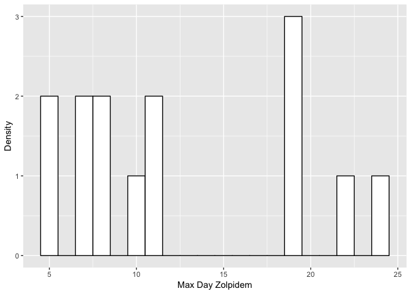

Mouse Behavioral Analysis
================
Jeremy Metha
17/1/19

These experiments aimed to investigate the effects of modulating sleep architecture on learning in a noisy environment. Animals were trained to push levers, then placed in a situation where one lever gives a reward on 80% of the time, while the other lever rewards only 20% of the time. Once animals were behaving optimally (defined by 2x days with &gt; 60 lever presses and &gt; 80% high rewarding lever choice), the high and low rewarding levers were switched, and animals were dosed daily with either TPGS vehicle, Zolpidem, or 1-SORA 51/MK1064 - OXR1/OXR2 selective anatonists, respectively in a dosage shown to increase REM sleep.

``` r
## Read and Wrangle
```

Weather dataset consists of trial by trial data from all animals across all days Day: Integer - day of the experiment including all pre-training Batch: 1-4 - session within a day in which animal was ran Subject: Integer - Identifier for each animal Session: Factor - "WTL" is probabilistic learning, "WTR" is reversal learning Time: Integer - Time of response since begining of trial in deciseconds Response: Binary - -1 is a response on low rewarding lever, +1 is a response on high rewarding lever, -1 is a response on the low rewarding lever Reward: Binary - 1 is a rewarding trial, 0 is a non-rewarding trial Trial: Integer - Trial number within a session indexed from 1 up to 100 ContinuousTrial: Integer - Trial number within and across sessions - represents all choices as a continuous stream SessionContinuous Trial: Integer - As above, but resets for reversal learning SessionDay: Integer - Day number within a session type WeatherDay: Integer - Day number in PL/RL continuously Drug: Factor - Drug type animal was dosed with in RL CumulativeSessionReward: Integer - Counts up total rewards ona given day CumulativeSessionResponse: Integer - Count of lever presses: indexes up by 1 with every high rewarding press, indexes down by one with every low rewarding press CumulativeTotalReward: Integer - As CumulativeSessionReward, but counts over days

``` r
## OP005_WTL = probabilistic learning, OP005_WTR = reversal learning with drug
##subject ID's given different drugs in WTR


library(readxl)
library(tidyverse)
```

    ## ── Attaching packages ─────────────────────────────────────────────────────────────────────────────────────────────── tidyverse 1.2.1 ──

    ## ✔ ggplot2 3.1.0     ✔ purrr   0.2.5
    ## ✔ tibble  1.4.2     ✔ dplyr   0.7.6
    ## ✔ tidyr   0.8.1     ✔ stringr 1.3.1
    ## ✔ readr   1.1.1     ✔ forcats 0.3.0

    ## ── Conflicts ────────────────────────────────────────────────────────────────────────────────────────────────── tidyverse_conflicts() ──
    ## ✖ dplyr::filter() masks stats::filter()
    ## ✖ dplyr::lag()    masks stats::lag()

``` r
library(anchors)
```

    ## Loading required package: rgenoud

    ## ##  rgenoud (Version 5.8-2.0, Build Date: 2018-04-03)
    ## ##  See http://sekhon.berkeley.edu/rgenoud for additional documentation.
    ## ##  Please cite software as:
    ## ##   Walter Mebane, Jr. and Jasjeet S. Sekhon. 2011.
    ## ##   ``Genetic Optimization Using Derivatives: The rgenoud package for R.''
    ## ##   Journal of Statistical Software, 42(11): 1-26. 
    ## ##

    ## Loading required package: MASS

    ## 
    ## Attaching package: 'MASS'

    ## The following object is masked from 'package:dplyr':
    ## 
    ##     select

    ## 
    ## ##  anchors (Version 3.0-8, Build Date: 2014-02-24)
    ## ##  See http://wand.stanford.edu/anchors for additional documentation and support.

``` r
library(lme4)
```

    ## Loading required package: Matrix

    ## 
    ## Attaching package: 'Matrix'

    ## The following object is masked from 'package:tidyr':
    ## 
    ##     expand

``` r
library(car)
```

    ## Loading required package: carData

    ## 
    ## Attaching package: 'car'

    ## The following object is masked from 'package:dplyr':
    ## 
    ##     recode

    ## The following object is masked from 'package:purrr':
    ## 
    ##     some

``` r
library(nlme)
```

    ## 
    ## Attaching package: 'nlme'

    ## The following object is masked from 'package:lme4':
    ## 
    ##     lmList

    ## The following object is masked from 'package:dplyr':
    ## 
    ##     collapse

``` r
rm(list = ls())


ORAs <- c(1, 3, 9, 13, 15, 16, 27, 30, 32, 35, 39, 41, 43)
Zolps <- c(4, 10, 11, 17, 18, 21, 23, 25, 29, 37, 42, 44, 45, 47)
TPGS <- c(2, 5, 6, 19, 20, 22, 24, 26, 28, 33, 38, 46)

weather <- read_xlsx("phase 5 data.xlsx", col_names = TRUE)
weather <- weather %>%
  filter(Subject != 8 & Subject != 40 & Subject != 48 & Subject != 29) %>% ## these animals are exluded for various reasons
  filter(is.na(Session) == FALSE) %>%
  group_by(Subject, Session) %>%
  mutate(SessionDay = Day - min(Day)+1) %>% ## days in a given session - either WTL or WTR
  ungroup() %>%
  group_by(Subject) %>%
  mutate(WeatherDay = Day - min(Day)+1) %>% ## days in the probabilistic environment
  mutate(Drug = if (Subject %in% ORAs){
    "DORAs"
  }
  else if (Subject %in% Zolps){
    "Zolpidem"
  }
  else "TPGS"
  ) %>% ## labels which drug was given to which animal in WTR... Ugly code and will throw warnings, but works!
  mutate(Reward = replace(Reward, Reward == -1, 0)) %>%
  group_by(Subject, WeatherDay) %>%
  mutate(CumulativeSessionReward = cumsum(Reward)) %>%
  mutate(CumulativeSessionResponse = cumsum(Response)) %>%
  group_by(Subject) %>%
  mutate(CumulativeTotalReward = cumsum(Reward))
```

    ## Warning in if (Subject %in% ORAs) {: the condition has length > 1 and only
    ## the first element will be used

    ## Warning in if (Subject %in% ORAs) {: the condition has length > 1 and only
    ## the first element will be used

    ## Warning in if (Subject %in% Zolps) {: the condition has length > 1 and only
    ## the first element will be used

    ## Warning in if (Subject %in% ORAs) {: the condition has length > 1 and only
    ## the first element will be used

    ## Warning in if (Subject %in% ORAs) {: the condition has length > 1 and only
    ## the first element will be used

    ## Warning in if (Subject %in% Zolps) {: the condition has length > 1 and only
    ## the first element will be used

    ## Warning in if (Subject %in% ORAs) {: the condition has length > 1 and only
    ## the first element will be used

    ## Warning in if (Subject %in% Zolps) {: the condition has length > 1 and only
    ## the first element will be used

    ## Warning in if (Subject %in% ORAs) {: the condition has length > 1 and only
    ## the first element will be used

    ## Warning in if (Subject %in% Zolps) {: the condition has length > 1 and only
    ## the first element will be used

    ## Warning in if (Subject %in% ORAs) {: the condition has length > 1 and only
    ## the first element will be used

    ## Warning in if (Subject %in% ORAs) {: the condition has length > 1 and only
    ## the first element will be used

    ## Warning in if (Subject %in% Zolps) {: the condition has length > 1 and only
    ## the first element will be used

    ## Warning in if (Subject %in% ORAs) {: the condition has length > 1 and only
    ## the first element will be used

    ## Warning in if (Subject %in% Zolps) {: the condition has length > 1 and only
    ## the first element will be used

    ## Warning in if (Subject %in% ORAs) {: the condition has length > 1 and only
    ## the first element will be used

    ## Warning in if (Subject %in% ORAs) {: the condition has length > 1 and only
    ## the first element will be used

    ## Warning in if (Subject %in% ORAs) {: the condition has length > 1 and only
    ## the first element will be used

    ## Warning in if (Subject %in% ORAs) {: the condition has length > 1 and only
    ## the first element will be used

    ## Warning in if (Subject %in% Zolps) {: the condition has length > 1 and only
    ## the first element will be used

    ## Warning in if (Subject %in% ORAs) {: the condition has length > 1 and only
    ## the first element will be used

    ## Warning in if (Subject %in% Zolps) {: the condition has length > 1 and only
    ## the first element will be used

    ## Warning in if (Subject %in% ORAs) {: the condition has length > 1 and only
    ## the first element will be used

    ## Warning in if (Subject %in% Zolps) {: the condition has length > 1 and only
    ## the first element will be used

    ## Warning in if (Subject %in% ORAs) {: the condition has length > 1 and only
    ## the first element will be used

    ## Warning in if (Subject %in% Zolps) {: the condition has length > 1 and only
    ## the first element will be used

    ## Warning in if (Subject %in% ORAs) {: the condition has length > 1 and only
    ## the first element will be used

    ## Warning in if (Subject %in% Zolps) {: the condition has length > 1 and only
    ## the first element will be used

    ## Warning in if (Subject %in% ORAs) {: the condition has length > 1 and only
    ## the first element will be used

    ## Warning in if (Subject %in% Zolps) {: the condition has length > 1 and only
    ## the first element will be used

    ## Warning in if (Subject %in% ORAs) {: the condition has length > 1 and only
    ## the first element will be used

    ## Warning in if (Subject %in% Zolps) {: the condition has length > 1 and only
    ## the first element will be used

    ## Warning in if (Subject %in% ORAs) {: the condition has length > 1 and only
    ## the first element will be used

    ## Warning in if (Subject %in% Zolps) {: the condition has length > 1 and only
    ## the first element will be used

    ## Warning in if (Subject %in% ORAs) {: the condition has length > 1 and only
    ## the first element will be used

    ## Warning in if (Subject %in% Zolps) {: the condition has length > 1 and only
    ## the first element will be used

    ## Warning in if (Subject %in% ORAs) {: the condition has length > 1 and only
    ## the first element will be used

    ## Warning in if (Subject %in% Zolps) {: the condition has length > 1 and only
    ## the first element will be used

    ## Warning in if (Subject %in% ORAs) {: the condition has length > 1 and only
    ## the first element will be used

    ## Warning in if (Subject %in% ORAs) {: the condition has length > 1 and only
    ## the first element will be used

    ## Warning in if (Subject %in% Zolps) {: the condition has length > 1 and only
    ## the first element will be used

    ## Warning in if (Subject %in% ORAs) {: the condition has length > 1 and only
    ## the first element will be used

    ## Warning in if (Subject %in% ORAs) {: the condition has length > 1 and only
    ## the first element will be used

    ## Warning in if (Subject %in% ORAs) {: the condition has length > 1 and only
    ## the first element will be used

    ## Warning in if (Subject %in% Zolps) {: the condition has length > 1 and only
    ## the first element will be used

    ## Warning in if (Subject %in% ORAs) {: the condition has length > 1 and only
    ## the first element will be used

    ## Warning in if (Subject %in% ORAs) {: the condition has length > 1 and only
    ## the first element will be used

    ## Warning in if (Subject %in% Zolps) {: the condition has length > 1 and only
    ## the first element will be used

    ## Warning in if (Subject %in% ORAs) {: the condition has length > 1 and only
    ## the first element will be used

    ## Warning in if (Subject %in% Zolps) {: the condition has length > 1 and only
    ## the first element will be used

    ## Warning in if (Subject %in% ORAs) {: the condition has length > 1 and only
    ## the first element will be used

    ## Warning in if (Subject %in% ORAs) {: the condition has length > 1 and only
    ## the first element will be used

    ## Warning in if (Subject %in% ORAs) {: the condition has length > 1 and only
    ## the first element will be used

    ## Warning in if (Subject %in% Zolps) {: the condition has length > 1 and only
    ## the first element will be used

    ## Warning in if (Subject %in% ORAs) {: the condition has length > 1 and only
    ## the first element will be used

    ## Warning in if (Subject %in% ORAs) {: the condition has length > 1 and only
    ## the first element will be used

    ## Warning in if (Subject %in% Zolps) {: the condition has length > 1 and only
    ## the first element will be used

    ## Warning in if (Subject %in% ORAs) {: the condition has length > 1 and only
    ## the first element will be used

    ## Warning in if (Subject %in% Zolps) {: the condition has length > 1 and only
    ## the first element will be used

    ## Warning in if (Subject %in% ORAs) {: the condition has length > 1 and only
    ## the first element will be used

    ## Warning in if (Subject %in% Zolps) {: the condition has length > 1 and only
    ## the first element will be used

    ## Warning in if (Subject %in% ORAs) {: the condition has length > 1 and only
    ## the first element will be used

    ## Warning in if (Subject %in% Zolps) {: the condition has length > 1 and only
    ## the first element will be used

``` r
## also need to add win-stay, lose shift stats
ShiftStay <- weather %>%
  mutate(winstay = ifelse(Response == lag(Response) & lag(Reward == 1), 1, 0)) %>%
  mutate(winshift = ifelse(Response != lag(Response) & lag(Reward == 1), 1, 0)) %>%
  mutate(losestay = ifelse(Response == lag(Response) & lag(Reward == 0), 1, 0)) %>%
  mutate(loseshift = ifelse(Response != lag(Response) & lag(Reward == 0), 1, 0)) %>%
  mutate(winstayhigh = ifelse(winstay == 1 & Response == 1, 1, 0)) %>%
  mutate(winstaylow = ifelse(winstay == 1 & Response == -1, 1, 0)) %>%
  mutate(winshifthigh = ifelse(winshift == 1 & Response == 1, 1, 0)) %>%
  mutate(winshiftlow = ifelse(winshift == 1 & Response == -1, 1, 0)) %>%
  mutate(losestayhigh = ifelse(losestay == 1 & Response == 1, 1, 0)) %>%
  mutate(losestaylow = ifelse(losestay == 1 & Response == -1, 1, 0)) %>%
  mutate(loseshifthigh = ifelse(loseshift == 1 & Response == 1, 1, 0)) %>%
  mutate(loseshiftlow = ifelse(loseshift == 1 & Response == -1, 1, 0)) %>%
  group_by(Subject, Session, SessionDay, Drug, WeatherDay) %>%
  summarise(WinStay = sum(winstay, na.rm = TRUE),
            WinShift = sum(winshift, na.rm = TRUE),
            LoseStay = sum(losestay, na.rm = TRUE),
            LoseShift = sum(loseshift, na.rm = TRUE),
            WinStayHigh = sum(winstayhigh, na.rm = TRUE),
            WinShiftHigh = sum(winshifthigh, na.rm = TRUE),
            LoseStayHigh = sum(losestayhigh, na.rm = TRUE),
            LoseShiftHigh = sum(loseshifthigh, na.rm = TRUE),
            WinStayLow = sum(winstaylow, na.rm = TRUE),
            WinShiftLow = sum(winshiftlow, na.rm = TRUE),
            LoseStayLow = sum(losestaylow, na.rm = TRUE),
            LoseShiftLow = sum(loseshiftlow, na.rm = TRUE),
            Trials = max(Trial),
            High = sum(Response == 1),
            Low = sum(Response == -1))
```

Looking at the length of time it takes between groups to complete the weather tasks

``` r
diff <- weather %>%
  group_by(SessionType, Subject, Day) %>%
  filter(Trial == max(Trial)) %>%
  group_by(Session, Subject) %>%
  filter(SessionDay == max(SessionDay))

diffsummary <- weather %>%
  group_by(SessionType, Subject, Day) %>%
  filter(Trial == max(Trial)) %>%
  group_by(Session, Subject) %>%
  filter(SessionDay == max(SessionDay)) %>%
  group_by(SessionType, Drug) %>%
  summarise(MeanDay = mean(SessionDay), Error = sd(SessionDay)/length(SessionDay), n = length(SessionDay))

maxday.TPGS <- diff %>%
  filter(Drug == "TPGS") %>%
  filter(Session == "WTR")

maxday.DORAs <- diff %>%
  filter(Drug == "DORAs") %>%
  filter(Session == "WTR")

maxday.Zolpidem <- diff %>%
  filter(Drug == "Zolpidem") %>%
  filter(Session == "WTR")

hist.TPGS <- ggplot(maxday.TPGS, aes(SessionDay)) +
  theme(legend.position = "none") +
  geom_histogram(aes(y = ..count..), colour = "black", fill = "white", binwidth = 1) +
  labs(x = "Max Day TPGS", y = "Density")
hist.TPGS
```


``` r
hist.DORAs <- ggplot(maxday.DORAs, aes(SessionDay)) +
  theme(legend.position = "none") +
  geom_histogram(aes(y = ..count..), colour = "black", fill = "white", binwidth = 1) +
  labs(x = "Max Day DORAs", y = "Density")
hist.DORAs
```


``` r
hist.Zolpidem <- ggplot(maxday.Zolpidem, aes(SessionDay)) +
  theme(legend.position = "none") +
  geom_histogram(aes(y = ..count..), colour = "black", fill = "white", binwidth = 1) +
  labs(x = "Max Day Zolpidem", y = "Density")
hist.Zolpidem
```



``` r
diff2 <- diff %>%
  group_by(Subject, Drug) %>%
  spread(Session, SessionDay) %>%
  summarise(WTL = mean(WTL, na.rm = TRUE),
            WTR = mean(WTR, na.rm = TRUE),
            ratio = mean(WTR, na.rm = TRUE)/mean(WTL, na.rm = TRUE)) %>%
  ungroup() %>%
  mutate(Drug = as.factor(Drug)) %>%
  mutate(Drug = relevel(Drug, ref = "TPGS")) %>%
  mutate(Subject = as.factor(Subject))

diff2plot <- ggplot(diff2, aes(x = WTL, y = WTR, colour = Drug)) +
  geom_point() +
  geom_smooth(method = "lm", se = FALSE)
diff2plot
```


``` r
completionmodel1 <- gls(WTR ~ 1, data = diff2, method = 'ML')
summary(completionmodel1)
```

    ## Generalized least squares fit by maximum likelihood
    ##   Model: WTR ~ 1 
    ##   Data: diff2 
    ##        AIC      BIC    logLik
    ##   242.4402 245.7154 -119.2201
    ## 
    ## Coefficients:
    ##                Value Std.Error  t-value p-value
    ## (Intercept) 11.44737 0.9166528 12.48823       0
    ## 
    ## Standardized residuals:
    ##        Min         Q1        Med         Q3        Max 
    ## -1.3356637 -0.7976225 -0.2595813  0.6371541  2.2512777 
    ## 
    ## Residual standard error: 5.575781 
    ## Degrees of freedom: 38 total; 37 residual

``` r
completionmodel2 <- update(completionmodel1, .~. + Drug)
summary(completionmodel2)
```

    ## Generalized least squares fit by maximum likelihood
    ##   Model: WTR ~ Drug 
    ##   Data: diff2 
    ##        AIC      BIC    logLik
    ##   246.0536 252.6039 -119.0268
    ## 
    ## Coefficients:
    ##                  Value Std.Error   t-value p-value
    ## (Intercept)  11.666667  1.668643  6.991707  0.0000
    ## DrugDORAs    -0.974359  2.313992 -0.421073  0.6763
    ## DrugZolpidem  0.333333  2.313992  0.144051  0.8863
    ## 
    ##  Correlation: 
    ##              (Intr) DrDORA
    ## DrugDORAs    -0.721       
    ## DrugZolpidem -0.721  0.520
    ## 
    ## Standardized residuals:
    ##        Min         Q1        Med         Q3        Max 
    ## -1.2618323 -0.8146445 -0.2426601  0.7326022  2.3988679 
    ## 
    ## Residual standard error: 5.547489 
    ## Degrees of freedom: 38 total; 35 residual

``` r
completionmodel3 <- update(completionmodel2, .~. + WTL)
summary(completionmodel3)
```

    ## Generalized least squares fit by maximum likelihood
    ##   Model: WTR ~ Drug + WTL 
    ##   Data: diff2 
    ##        AIC      BIC    logLik
    ##   245.5118 253.6998 -117.7559
    ## 
    ## Coefficients:
    ##                  Value Std.Error   t-value p-value
    ## (Intercept)   9.739340 2.0640174  4.718633  0.0000
    ## DrugDORAs    -1.192922 2.2750227 -0.524356  0.6034
    ## DrugZolpidem  1.068499 2.3206059  0.460440  0.6481
    ## WTL           0.238432 0.1554708  1.533614  0.1344
    ## 
    ##  Correlation: 
    ##              (Intr) DrDORA DrgZlp
    ## DrugDORAs    -0.533              
    ## DrugZolpidem -0.685  0.495       
    ## WTL          -0.609 -0.063  0.207
    ## 
    ## Standardized residuals:
    ##        Min         Q1        Med         Q3        Max 
    ## -1.3377395 -0.8463570 -0.1620289  0.4874796  2.1249167 
    ## 
    ## Residual standard error: 5.365027 
    ## Degrees of freedom: 38 total; 34 residual

``` r
completionmodel4 <- update(completionmodel3, .~. + Drug:WTL)
summary(completionmodel4)
```

    ## Generalized least squares fit by maximum likelihood
    ##   Model: WTR ~ Drug + WTL + Drug:WTL 
    ##   Data: diff2 
    ##        AIC      BIC    logLik
    ##   246.6696 258.1327 -116.3348
    ## 
    ## Coefficients:
    ##                      Value Std.Error   t-value p-value
    ## (Intercept)      11.604984  2.368177  4.900388  0.0000
    ## DrugDORAs        -5.225954  3.657608 -1.428790  0.1628
    ## DrugZolpidem     -2.304984  3.651606 -0.631225  0.5324
    ## WTL               0.007631  0.213027  0.035821  0.9716
    ## DrugDORAs:WTL     0.471622  0.333442  1.414406  0.1669
    ## DrugZolpidem:WTL  0.532369  0.506782  1.050490  0.3014
    ## 
    ##  Correlation: 
    ##                  (Intr) DrDORA DrgZlp WTL    DDORA:
    ## DrugDORAs        -0.647                            
    ## DrugZolpidem     -0.649  0.420                     
    ## WTL              -0.727  0.471  0.472              
    ## DrugDORAs:WTL     0.465 -0.786 -0.301 -0.639       
    ## DrugZolpidem:WTL  0.306 -0.198 -0.770 -0.420  0.269
    ## 
    ## Standardized residuals:
    ##        Min         Q1        Med         Q3        Max 
    ## -1.4563084 -0.6930498 -0.1857553  0.5834880  2.0394383 
    ## 
    ## Residual standard error: 5.16809 
    ## Degrees of freedom: 38 total; 32 residual

``` r
anova(completionmodel1, completionmodel2, completionmodel3, completionmodel4)
```

    ##                  Model df      AIC      BIC    logLik   Test   L.Ratio
    ## completionmodel1     1  2 242.4402 245.7154 -119.2201                 
    ## completionmodel2     2  4 246.0536 252.6039 -119.0268 1 vs 2 0.3866206
    ## completionmodel3     3  5 245.5118 253.6998 -117.7559 2 vs 3 2.5417409
    ## completionmodel4     4  7 246.6696 258.1327 -116.3348 3 vs 4 2.8422656
    ##                  p-value
    ## completionmodel1        
    ## completionmodel2  0.8242
    ## completionmodel3  0.1109
    ## completionmodel4  0.2414

Looking at days to criterion, there's no significant difference between groups. The next thing to do is start looking at day-by-day data

``` r
ratioPresses <- weather %>%
  group_by(Subject, SessionDay, Drug, Session, WeatherDay) %>%
  summarise(Total = max(Trial), PercentHigh = sum(Response == 1)/max(Trial)*100)

ratioPresses <- ratioPresses[-c(285, 309),] ## duplicate data, needed removing. Not sure how it got there?


ratioPressesPlot <- ggplot(ratioPresses, aes(x = WeatherDay, y = PercentHigh, colour = Session, shape = Drug)) +
  geom_point() +
  geom_hline(yintercept = 50)+
  facet_wrap(~Subject)
ratioPressesPlot
```


``` r
justWTRRatios <- ratioPresses %>%
  filter(Session == "WTR") %>%
  group_by(Subject) %>%
  mutate(WTL = min(WeatherDay)-1) # adding the length of time an animal spent in WTL as a predictor possibly?
```

Heirachy of data:

Bottom-level: percentage of correct lever presses made by an animal on a given day - spans over many days until completion Total presses made by a particular animal on a particular day - may be a proxy for effort could also expand this to include WTL training days

Mid-level: Individual animal IDs matched with animal IDs is the number of days it took them to reach criterion in the WTL learning phase - this may be a proxy for intellegence

Top-level: Drug group to which animal is assigned - this is the effct we want to look at
